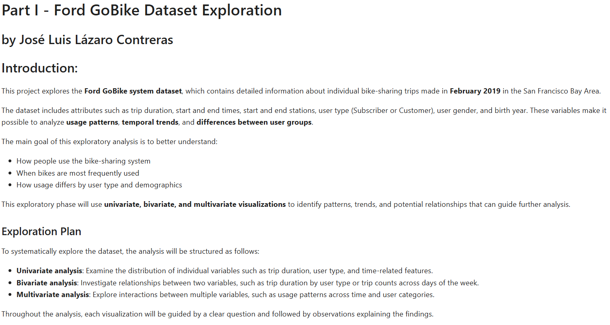
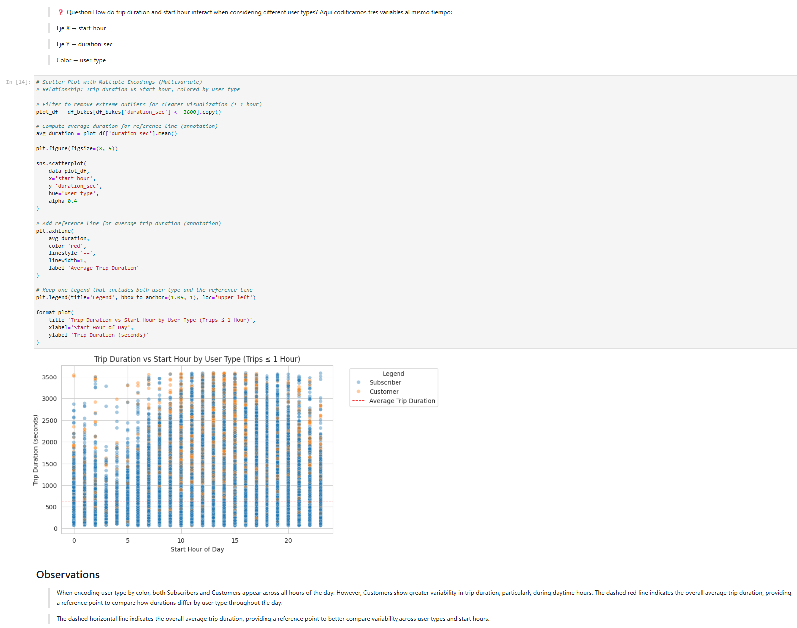

# Ford GoBike Dataset Exploration

## Project Overview
This project explores usage patterns in the **Ford GoBike bike-sharing system** using trip-level data from February 2019. The goal of the analysis is to understand how different factors—such as user type and time of day—influence trip duration and overall system usage.

The project follows a structured exploratory data analysis (EDA) approach and includes both **exploratory (Part I)** and **explanatory (Part II)** analyses.

---

## Dataset
The dataset contains detailed information about individual bike trips, where each row represents a single ride. Key features include:

- Trip duration (in seconds)
- Start and end time
- User type (Subscriber or Customer)
- Bike and station data
- Demographic information (where available)

The data was provided as part of the Udacity Data Analyst Nanodegree program.

---

## Project Structure
The repository is organized as follows:

├── Part_I_Ford_GoBike_Dataset_Exploration.ipynb
├── Part_I_Ford_GoBike_Dataset_Exploration.html
├── Part_II_Ford_GoBike_Dataset_Exploration.ipynb
├── Part_II_Ford_GoBike_Dataset_Exploration.html
├── 201902-fordgobike-tripdata.csv
└── README.md

- **Part I** focuses on exploratory analysis to identify patterns and relationships in the data.
- **Part II** presents a concise explanatory story supported by polished visualizations.

---

## Key Questions
The analysis is guided by the following questions:

- How long do most trips last?
- How does trip duration vary by **user type**?
- Are there noticeable patterns in usage across different **hours of the day**?
- Which factors best explain differences in trip duration?

---

## Summary of Findings

- **Trip duration is highly right-skewed**, with most trips lasting only a few minutes.
- **User type is the most important differentiator**:
  - Subscribers tend to take shorter, more consistent trips.
  - Customers typically take longer trips with greater variability.
- Trips occur throughout the day, with higher usage during **commuting hours**, but **start time alone does not strongly affect trip duration**.
- Combining user type with time-based features provides a deeper understanding of usage patterns.

---

## Methods and Tools
- Python
- pandas
- matplotlib
- seaborn
- Jupyter Notebook

A step-by-step approach was followed:
1. Univariate Exploration
2. Bivariate Exploration
3. Multivariate Exploration

Reusable plotting functions were implemented to reduce code repetition and improve readability.

---

## Explanatory Analysis (Part II)
The explanatory notebook highlights the most important insights from the exploration using a small number of well-designed visualizations. The focus is on clearly communicating how **user type** and **time of day** interact to explain trip duration patterns.

---


## Sample Visualizations
Below are some key visualizations from the analysis:

## Intro Ford GoBike


## Facet Plot Trip Duration by User Type
.png)


## Scatter plot with multiple encodings


## How to Run the Project
1. Clone the repository:
   ```bash
   git clone https://github.com/pepeluseo/ford-gobike-dataset-exploration.git


Author
José Luis Lázaro Contreras
Data Analyst (in training)
This project was completed as part of the Udacity Data Analyst Nanodegree.
